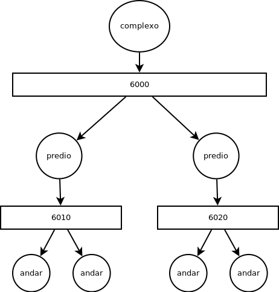
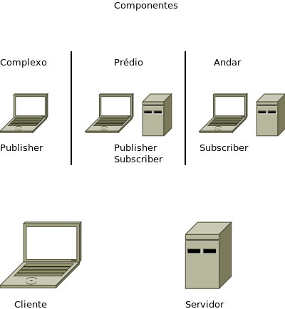

# Comunicação distribuída

Esta é a primeria parte de um trabalho de Sistemas Distribuídos, ela inclui a parte funcional do sistema, i.e.: os componentes e suas interações.

## Domínio do problema

A descrição do problema pode ser lida no arquivo PDF: [Descrição](/TG-Enunciado.pdf)

Algumas considerações:
- Cada pessoa sempre entra pelo complexo.
- Todos tem um caminho, i.e., um destino pré-fixado.
- Há somente liberação para aqueles destino.
- O número de prédios e andares é fixo.

## Solução

Foi utilizada uma topologia hierárquica publisher-subscriber utilizando a ferramenta de comunicação [ZeroMQ](http://zeromq.org/) (zero message queue) como descreve a imagem:



O complexo apenas recebe pedidos de entrada (*aleatória*, segundo a função rand()) de pessoas físicas.

O prédio correspondente, recebe tais requisições apresentando-as na tela e as envia para o canal dos andares. Ele também guarda uma requisição para fins de gerencia no próprio servidor (*cada prédio contém um*).

O andar correspondente, recebe a requisição e apresenta na tela, além de guardá-la para fins de gerencia. Sendo este, um pequeno servidor na própria máquina que executa o cliente.

Neste modelo, há dois compenentes de processamento das mensagens:
- [Cliente.py](codigos/cliente.py)
- [Servidor.py](codigos/servidor.py)

Sendo estruturados da seguinte forma:



Cada componente apresenta um terminal para exibir as informações.

## Executando os códigos

### Pre-requisitos

- Ter installado a versão mais recente de Python
- Ter instalado o ZeroMQ

```
pip install zmq
```

Baixe a pasta codigos deste repositório, e para cara arquivo:

- [complexo.py](codigos/complexo.py)
- [predio.py](codigos/predio.py)
- [andar.py](codigos/andar.py)

deverá ser aberto um terminal e executado o arquivo em sequência, ex:

```
python complexo.py
```
e repita para cada arquivo

### Argumentos

Ao executar o primerio arquivo (complexo.py), nenhum argumento é necessário, a menos que queira mudar a porta padrão de execução que está configurada para ser a 6000.

Já para o segundo arquivo (andar.py), deve ser informado o número do andar ao qual aquele terminal corresponderá, ex:
```
python predio.py 1
```
para o terminal ser responsável pelo andar 1

E para o último argumento (andar.py), deverá ser passado o número do prédio correspondente e o número do andar, ex:
```
python andar.py 1 1
```
sendo este terminal, responsável pelo andar 1 do prédio 1.
> É desnecessário dizer que o prédio deve ser criado para o andar receber às informações.

## Contribuição

É importante resaltar que anteriormente foi feita uma parte do código em outro grupo, sendo eu o único responsável pelo seu desenvolvimento. Para fins de evitamento de plágio, declaro que os código reaproveitados foram [cliente.py](codigos/cliente.py) e [servidor.py](codigos/servidor.py)

## Autores

* **Denys Pacheco** - *Trabalho completo* - [Denys Pacheco](https://github.com/DenysPacheco)

## Observações

* Ainda há muito que polir no código
* Além de limpar algumas partes, e corigir outras com refatorações
* Bom como deixá-lo mais dinâmico e de fácil utilização
